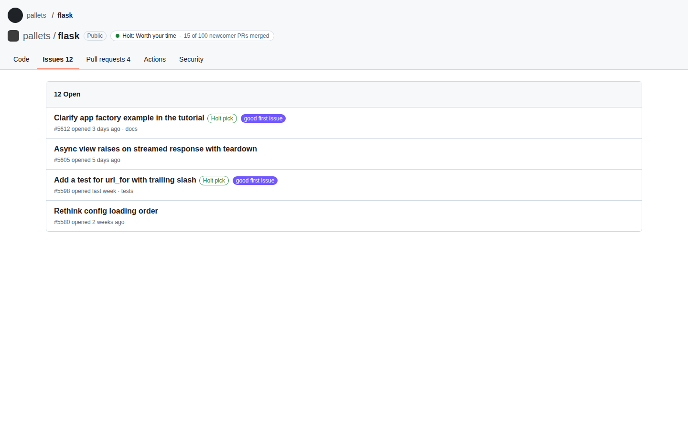

# Holt for GitHub (browser extension)

Puts a small Holt chip next to the repository name on github.com:

- **Holt: Worth your time · 15 of 100 newcomer PRs merged**
- **Holt: Not worth your time** / **Holt: Not enough evidence**
- **Check with Holt** when Holt has no report for the repo yet

Clicking the chip opens the full report at `https://<HOLT_HOST>/<owner>/<repo>`
(for a repo with no report, that page starts the analysis). On a repo's issue
list (`/issues`, `/contribute`), issues that Holt ranks as good first picks get
a small **Holt pick** mark; hover it to see why.

It follows GitHub's light and dark themes (it uses GitHub's own colour
variables) and works with GitHub's in-page navigation.



## Privacy and permissions

- Host permissions: `https://github.com/*` and the Holt host. Nothing else: no
  `tabs`, no history, no storage, no cookies.
- For each repo page you open, the extension sends that `owner/repo` to the
  Holt host, and nothing else. No login, no tracking. Answers are cached in
  memory for 15 minutes.
- It is read-only: it never writes to GitHub.

## Build

Needs Node 20+.

```sh
cd extension
npm ci
npm test              # vitest + jsdom
npm run typecheck
npm run build         # → dist/chrome and dist/firefox
```

The Holt host is fixed at build time:

```sh
HOLT_HOST=holt.example.com npm run build
```

It defaults to `githolt.com` and is always reached over HTTPS.

## Load it unpacked

**Chrome / Edge / Brave:** open `chrome://extensions`, turn on **Developer
mode**, click **Load unpacked** and pick `extension/dist/chrome`. After a
rebuild, press the reload icon on the extension card and refresh GitHub.

**Firefox (121+):** open `about:debugging#/runtime/this-firefox`, click **Load
Temporary Add-on…** and pick `extension/dist/firefox/manifest.json`. If the
chip doesn't show, open `about:addons` → Holt for GitHub → Permissions and
make sure both sites are allowed.

## How it works

| File | What |
|---|---|
| `src/content.ts` | Content script on github.com. Re-syncs on Turbo/pjax events, `popstate`, and DOM changes (GitHub re-renders without events). |
| `src/page.ts` | Idempotent `sync(pathname)`: finds the repo, places/updates the chip, marks starter issues. One lookup per repo per page. |
| `src/chip.ts`, `src/issues.ts` | The DOM work. Text goes in via `textContent` only. |
| `src/background.ts` | Fetches `GET /api/public/report/…` and `/api/public/starter-issues/…` (see "Public proxy" in `/API.md`). Content scripts can't make cross-origin requests under the extension's host permission, so fetching lives here. |
| `src/repo.ts` | Which github.com paths are repos. |
| `fixtures/` | A trimmed GitHub repo page for screenshots: `npm run fixture`, then open `fixtures/github-repo.html` (add `?state=missing`, `not_viable`, `insufficient_evidence`, or `loading` for the skeleton chip). |

If GitHub changes its markup and the chip disappears, the selectors to update
are `ANCHORS` in `src/chip.ts` and `isTitleLink` in `src/issues.ts`.

## Packaging for the stores

`dist/chrome` and `dist/firefox` are the upload roots; zip each folder's
contents. Store copy is in [STORE.md](STORE.md).
